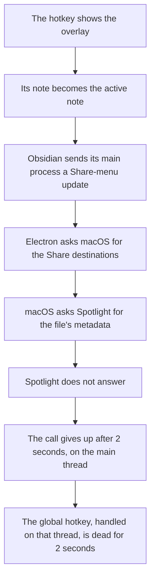

# From a 2-second freeze to 1.4 ms in an Obsidian capture overlay

I wanted a capture window for Obsidian like the one in Drafts: one global hotkey that shows a single note in a small window over whatever I am doing, and hides it again. The first version worked, but Obsidian froze for about two seconds after every show, key presses went missing, and the window would not appear over an app in full screen. A fix written from reading the code changed nothing I could feel, which left the question of where the time was going. Measurement showed the plugin's own work on a show took under 35 ms. The freeze was macOS's Share-menu lookup waiting on a broken Spotlight index, and the full-screen problem went away once the window was created as a macOS panel.

The work took one day, 5 October 2026, and 470 logged key presses.

## Results

| What | First version | Now | Basis |
|---|---|---|---|
| Obsidian's main process frozen after each show | median 2,033 ms (7 shows) | median 1.4 ms, worst 15.3 ms (39 shows) | measured |
| Key presses lost | 3 to 4 per show (7 shows) | none in 39 shows and 40 hides; presses are now queued, longest wait 73 ms | measured |
| Hide: previous app in front again | median 2,030 ms (7 hides) | does not apply; the overlay no longer takes the previous app out of front | measured before; after confirmed by typing |
| Show: first frame drawn | median 31.8 ms, worst 2,060 ms (7 shows) | median 20.9 ms, worst 529 ms (63 shows) | measured |
| Hide: window gone | 0.5 ms (7 hides; the window was only made transparent) | median 7.4 ms, worst 318 ms (63 hides) | measured |
| Shows over another app in full screen | no | yes, with the Dock icon kept | observed by eye |

All timings are milliseconds from the start of the plugin's hotkey callback, written by the plugin itself (see Evidence). Three things were not measured: the time between the physical key press and the callback, any arrangement other than a windowed app in front of Obsidian on a second display, and any machine other than mine (Apple Silicon, macOS 26.5, Obsidian 1.13.7 on Electron 39.2.6).

## The problem

A capture tool is worth having only if it is faster than opening the app. At two seconds a press, with presses lost, I would not have used it. Nothing else depended on this tool, so I make no claim about money or time saved.

## My part and the agent's part

I worked with an AI coding agent, Claude, running in Claude Code.

I set the requirements and the working rule: measure before changing anything, change one thing per round, and stop to ask me before any fix with a visible cost. I ran every trial by hand, because my setup does not let the agent launch or control Obsidian. I made the trade-off calls, including accepting a Share menu that no longer updates and accepting the stall that remains. Two things I noticed changed the direction of the work: a colour wheel on a plain mouse click, and the question of how Drafts floats over full-screen apps while keeping its Dock icon.

The agent wrote the plugin and the measurement code, proposed the hypotheses, read the log after each trial, recorded Obsidian's main thread, wrote the reproduction script, and drafted this account from the project's logs and decision record.

## Constraints and non-goals

- The overlay had to be the real Obsidian editor in an Obsidian window, so the plugin could not create a window of its own.
- No dependencies, no network listener and no helper program, in code small enough for me to read all of it. It is about 500 lines.
- The Dock icon had to stay.
- The agent could not see or drive the app. Every data point had to come from me pressing a key.

I did not attempt a release in Obsidian's community directory, support for other platforms, or a repair of Spotlight from inside a plugin.

## Decisions and dead ends

### 1. Make the plugin report on itself

With no way for the agent to observe the app, the options were for me to describe what I saw, to record the screen, or to have the plugin write its own timings. I chose the third. While a `debug.json` file sits beside the plugin, each key press appends one line to a log: milliseconds to each stage, the build hash, and the name of the variant under test. The plugin re-reads that file on every press, so the agent could switch variants between trials without my reloading anything. The cost is a blind spot. Time before the callback starts is invisible.

### 2. The freeze was not where either of us looked

The first log settled one thing at once. A show finished in under 35 ms and a hide made the window invisible in under 2 ms, yet after every show the next callback arrived about 2.06 seconds later, regular to within a few milliseconds. That regularity pointed to a timeout. A probe added to the plugin confirmed that Obsidian's main process stalled for a median of 2,033 ms after each show.

The agent's hypothesis was that taking keyboard focus activated the whole app, and that something in activation blocked. It tested that one variant at a time.

| Variant | Shows | Main-process stall, median | Verdict |
|---|---|---|---|
| Take focus, as in the first version | 7 | 2,033 ms | the problem |
| Show without taking focus | 22 | 0.5 ms | no freeze, but it cannot be typed into |
| Take focus, on one desktop only | 9 | 1,843 ms | not the cause |
| Activate the app instead of the window | 1 | 2,008 ms | not the cause |
| Take focus, with no app in full screen anywhere | 5 | 1,633 ms | not the cause |
| Take focus, with the Share-menu update dropped | 39 | 1.4 ms | the fix |

Not taking focus removed the freeze, which looked like confirmation. Every variant that took focus still froze, whatever else changed. Then I noticed that clicking into the overlay with the mouse also produced a colour wheel. The plugin makes no focus call on a mouse click, so the cause had to be in Obsidian or below it.

A recording of Obsidian's main thread, made with macOS's `sample` tool, found it waiting inside `NSSharingService sharingServicesForItems:`, the call that lists Share destinations. Obsidian updates its File > Share menu every time the active note changes, and showing the overlay changes the active note. A ten-line Swift script making the same call, with Obsidian not involved, took between 2,021 and 2,038 ms per call after the first, for three different files. A recording of that script showed it waiting on a metadata query to Spotlight. Spotlight on my Mac was broken: `mdls /etc/hosts` took 10.4 seconds and returned nothing.

There were two possible fixes. Repairing Spotlight is the real one, but a plugin cannot do it, and it was still outstanding when I wrote this. The fix within reach was to stop that one menu update. The plugin wraps the function Obsidian's window uses to message its main process, and removes the Share-menu item from the update. The cost is that File > Share in that vault no longer follows the active note, and the filter depends on an internal message name that an Obsidian update could change.

### 3. A panel, when the plan was to give up the Dock icon

An ordinary window can take the keyboard only by activating its app. That brought Obsidian's main window forward, and it needed a helper process afterwards to hand focus back. An ordinary window also would not appear over another app in full screen. Electron's documented route is to turn the app into one with no Dock icon, and that was the next trial on the list.

I asked how Drafts manages it with its Dock icon in place. The usual way for a native app is a panel, a kind of window that takes the keyboard without activating its app. I did not check that Drafts itself uses one. Electron supports panels, but only as an option set when a window is created, and here Obsidian creates the window. Reading how Obsidian opens a popout showed that it calls `window.open` with a feature string, and Electron turns any feature it does not recognise into a window option. So the plugin appends `type=panel` to the features for that one call.

I confirmed by eye that typing landed in the overlay, the main window stayed behind, the overlay appeared over an app in full screen, and the Dock icon stayed. A panel never takes the previous app out of front, so the focus hand-back and both helper processes could be deleted. That took a hide from a median of 78 ms of busy time to a single call.

### 4. Rapid presses

With show and hide reduced to one call each, 11 of 40 hides still took between 422 and 508 ms during bursts of fast pressing. The slow hides sat next to shows that had not yet drawn a frame. The plugin now queues presses, where before it ignored a press that arrived mid-toggle, and a hide waits for the first frame after the latest show. After that change, 3 of 63 hides took over 100 ms and 8 of 63 shows drew their first frame later than that.

## What I built

About 500 lines of plain JavaScript with no dependencies. `src/pure.js` holds the logic that can be tested without Obsidian, `src/plugin.js` holds everything that touches Obsidian and Electron, and `tools/latency.mjs` summarises the log. The [README](../README.md) covers installation and the undocumented surfaces the plugin relies on.

## What is not fixed, and what I would change

- Under rapid pressing, about one show in eight and one hide in twenty still stall for up to half a second. The cause is inferred from the pattern in the log and was not observed directly. The untried alternative is never to hide the window and only make it transparent.
- File > Share in the host vault does not follow the active note.
- The panel and the filter both rest on Obsidian internals read from version 1.13.7. An update could break either one without an error.
- It has run on one Mac.
- The first-frame comparison in the results table is not like for like. The first run was pressed at about two presses a second, and the last run as fast as I could.
- The first fix was written before anything was measured, and it was wasted work. Next time the timing log comes first.

## Who else has this

- Anyone building a quick-capture or command-palette window inside an Electron app they do not control can try the `type=panel` feature.
- Any Electron app with a Share menu item on macOS may block its main process in the same way when Spotlight is unhealthy. I verified that for Obsidian only. The wider claim is an inference from the system call involved.
- Anyone using a coding agent on a problem the agent cannot observe can reuse the measurement design: the program writes its own evidence, and the variant under test is switched from a file.

## Evidence

- [docs/evidence/latency-1.jsonl](evidence/latency-1.jsonl) and [latency-2.jsonl](evidence/latency-2.jsonl) hold every logged key press, 470 lines, each with the build hash and variant. `node tools/latency.mjs docs/evidence/latency-2.jsonl` reproduces the medians and worst cases. The counts over a threshold can be checked against the same files.
- [docs/evidence/stack-samples.txt](evidence/stack-samples.txt) holds excerpts of the three recordings.
- [tools/share-lookup.swift](../tools/share-lookup.swift) is the reproduction outside Obsidian. Run it with `swift tools/share-lookup.swift /etc/hosts`. On a healthy Mac it should return in milliseconds; I have not run it on one.
- In [src/plugin.js](../src/plugin.js), `filterMenuUpdates` is the Share-menu filter, `openPanel` requests the panel, and `toggleOnce` is the show and hide path.
- Electron's panel option is described in the [BaseWindow documentation](https://electronjs.org/docs/latest/api/base-window) and in pull requests [34388](https://github.com/electron/electron/pull/34388) and [41750](https://github.com/electron/electron/pull/41750).
